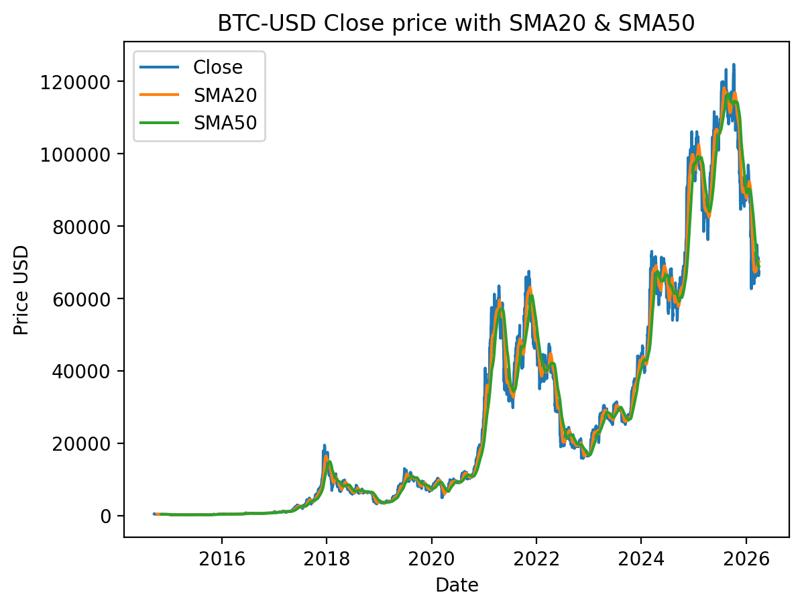
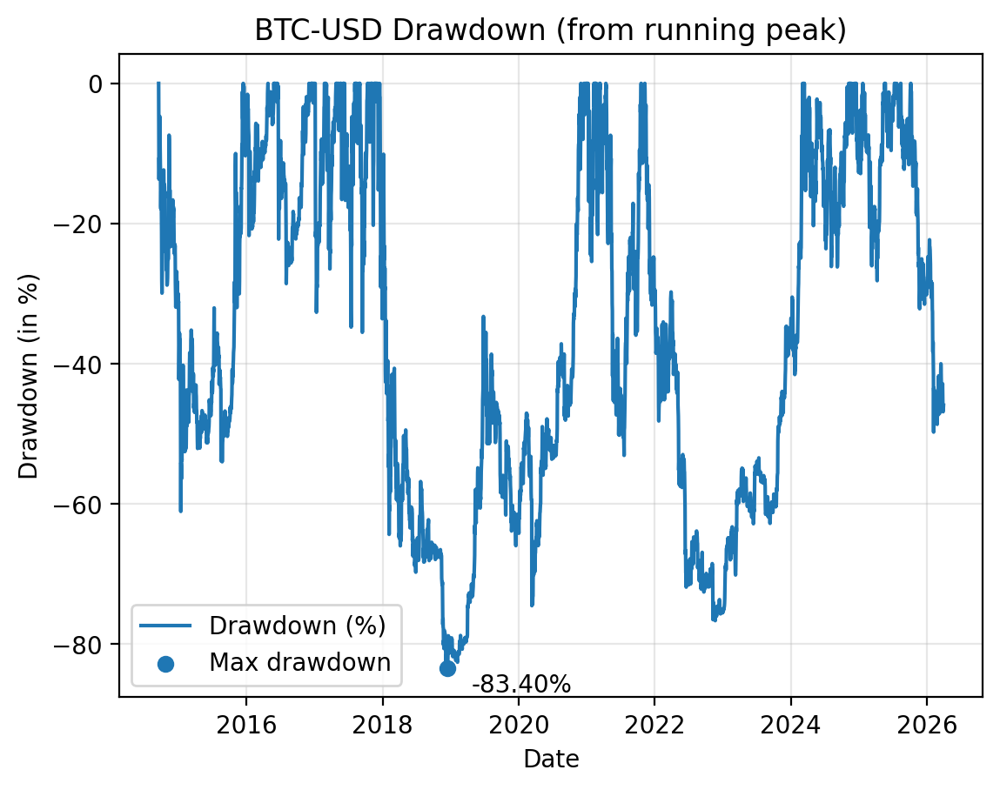
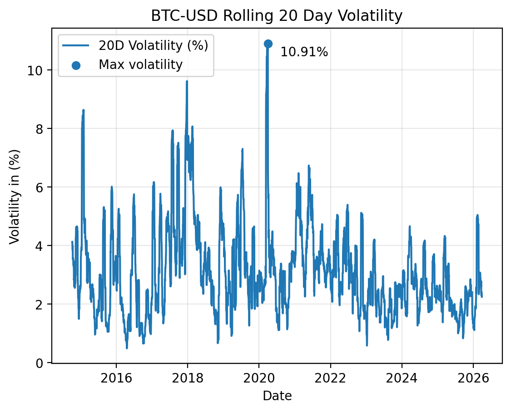

# BTC-USD Pandas Dashboard

A small pandas project that downloads BTC-USD pair daily price data and generates:
- summary metrics (return, volatility, max drawdown)
- monthly returns table
- charts: price with SMA20/SMA50, drawdown and rolling 20 day volaitlity

## Project Structure
- 'src/': Python scripts
- 'data/': downloaded BTC-USD CSV
- 'outputs/': generated CSV reports and charts

## Setup
```bash
pip3 install -r requirements.txt
```

## Charts (examples)
### Price with SMA20/SMA50


### Drawdown


### Rolling 20-day Volatility


## Machine Learning Extension
This project also includes a beginner friendly learning extension that predicts whether BTC/USD will go up or not the next day.

##Target
- `next_day_up = 1` if tomorrow's adjusted close is higher than todays adj. close
- `next_day_up =0/` otherwise

### Features Used
- `daily_return`
- `return_lag1`
- `return_lag2`
- `sma20`
- `sma50`
- `sma_gap_pct`
- `vol20_pct`
- `drawdown_pct`

### Models Compared
- Logistic Regression
- Random Forest Classifier

### Evaluation Approach
- Time-based split
- First 80% of observations used for training
- Last 20% used for testing
- Compared against simple baseline accuracy
- Evaluated using accuracy, confusion matrix, and classification report

### ML Output Files
- `outputs/ml_report.txt` -> summary of model results
- `outputs/ml_predictions.csv` -> row-by-row actual vs predicted values

### Main Finding
Both Logistic Regression and Random Forest showed weak predictive performance for BTC-USD next day direction. Their results were close to the simple baseline, which suggests that the current return, trend, volatility, and drawdown features do not provide a strong enough signal for reliable next day direction prediction.